**A list of all my conference talks.**

[Back to annikatjuka.com](https://annikatjuka.github.io/)

# 2022

<a href="slides/tjuka2022_CSSS_DLCE_DepartmentMeeting.pdf" target="_blank">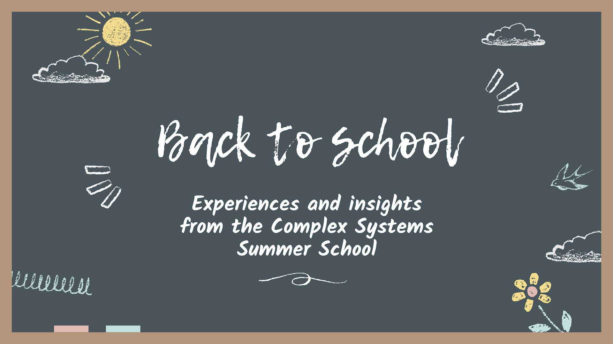</a>

Back to school - Experiences and insights from the Complex Systems Summer School

_Meeting of the Department of Linguistic and Cultural Linguistics_. Leipzig, DE.

- <a href="slides/tjuka2022_CSSS_DLCE_DepartmentMeeting.pdf" target="_blank">Slides
  
  
<a href="slides/tjuka2022_body_object_semshifts_school.pdf" target="_blank">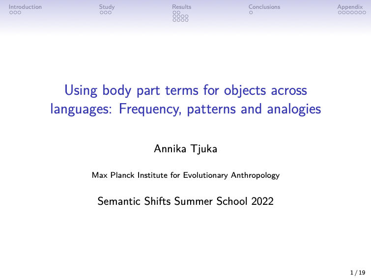</a>

Using body part terms for objects across languages: Frequency, patterns and analogies

_<a href="https://semanticshifts.sciencesconf.org/" target="_blank">Semantic Shifts Summer School: From lexicon to grammar. Diachronic and typological perspectives</a>_. Fréjus, FR.

- <a href="slides/tjuka2022_body_object_semshifts_school.pdf" target="_blank">Slides

Comparing sensory properties of words between English, Dutch, and Italian

_<a href="https://www.kogwis2022.uni-freiburg.de/" target="_blank">The Biannual Conference of the German Cognitive Science Society</a>_. Freiburg, DE.

- <a href="slides/tjuka2022-NoRaRe-KogWis_poster.pdf" target="_blank">Poster</a>

<a href="slides/tjuka2022-body-object-colexification-DGKL.pdf" target="_blank">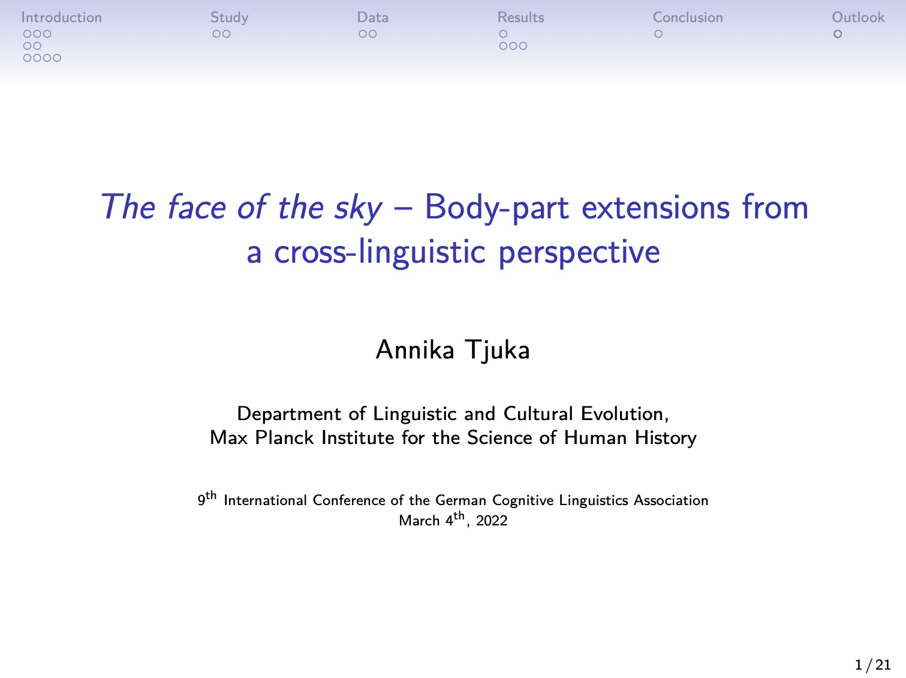</a>

_The face of the sky_ – Body-part extensions from a cross-linguistic perspective

_<a href="https://www.uni-erfurt.de/en/philosophische-fakultaet/seminare-professuren/sprachwissenschaft/research/9th-international-conference-of-the-german-cognitive-linguistics-association-dgkl-gcla-9" target="_blank">9th International Conference of the German Cognitive Linguistics Association</a>_. Erfurt, online.

- <a href="slides/tjuka2022-body-object-colexification-DGKL.pdf" target="_blank">Slides

- <a href="https://www.uni-erfurt.de/fileadmin/fakultaet/philosophische/Sprachwissenschaft/BoA_DGKL_GCLA-9_2022-02-23.pdf" target="_blank">Abstract (PDF page 102)</a>

# 2021

<a href="https://pad.gwdg.de/s/KLgI9TLrP" target="_blank">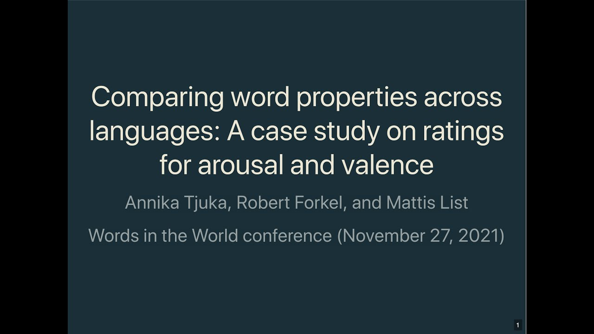</a>

Comparing word properties across languages: A case study on ratings for arousal and valence

_<a href="https://wordsintheworld.ca/wow-conference/" target="_blank">2nd Words in the World (WoW) International Conference</a>_. Canada, online.

- <a href="https://pad.gwdg.de/s/KLgI9TLrP" target="_blank">Slides</a>

- <a href="https://youtu.be/3yQj0Jtmszs" target="_blank">Video</a>

- <a href="https://wordsintheworld.ca/wp-content/uploads/2021/11/WOW-Abstract-Book-Updated-Nov25.pdf" target="_blank">Abstract (PDF page 136)</a>

Patterns of body-object colexifications across languages

_<a href="https://www2.helsinki.fi/en/conferences/emerging-topics-in-typology" target="_blank">Emerging Topics in Typology. International Workshop Series</a>_. University of Helsinki, online.

- <a href="slides/tjuka2021_body-object-colexification_ETT.pdf" target="_blank">Slides</a>

- <a href="https://jottacloud.com/s/135f0f29b8e505b4e5ab91988b9ce4a17f0" target="_blank">Abstract</a>

<a href="slides/tjuka2021-face-Vietnamese-CLIC.pdf" target="_blank">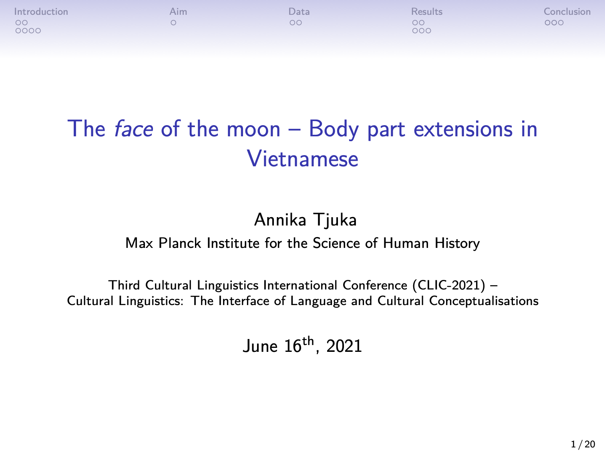</a>

The face of the moon -- Body part extensions in Vietnamese

_<a href="https://scitope.com/clic-2020/" target="_blank">3rd Cultural Linguistics International Conference (CLIC-2021)</a>_. Budapest, online.

- <a href="slides/tjuka2021-face-Vietnamese-CLIC.pdf" target="_blank">Slides</a>

- <a href="https://drive.google.com/file/d/15kJzFL3_vEvYzkBRdj8L2CxHCovF-v7Q/view" target="_blank">Abstract (page 121)</a>

<a href="slides/tjuka2021-body-colexifications-DUCOG.pdf" target="_blank">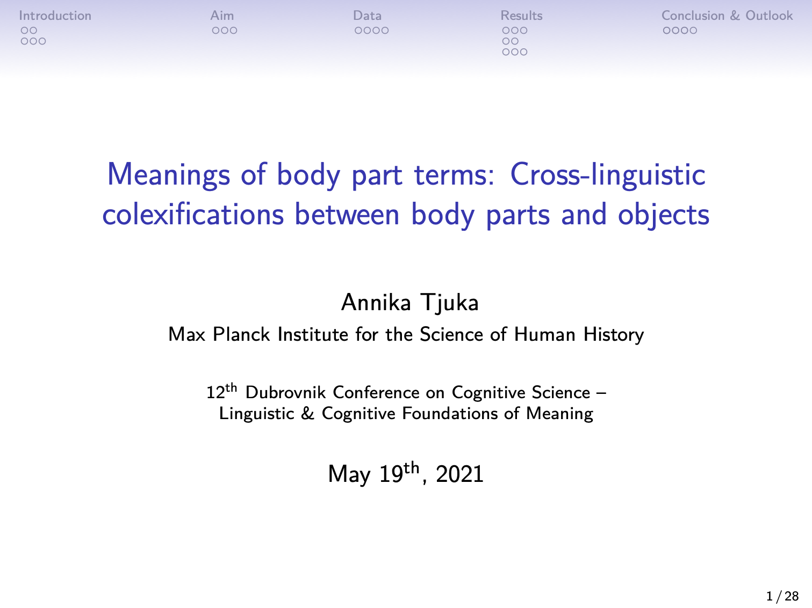</a>

Meanings of body part terms: Cross-linguistic colexifications between body parts and objects

_12th Dubrovnik Conference on Cognitive Science – Linguistic & Cognitive Foundations of Meaning (DUCOG2021)_. Dubrovnik, online.

- <a href="slides/tjuka2021-body-colexifications-DUCOG.pdf" target="_blank">Slides</a>

- <a href="https://youtu.be/AdaagTy00M8" target="_blank">Video</a>

# 2020

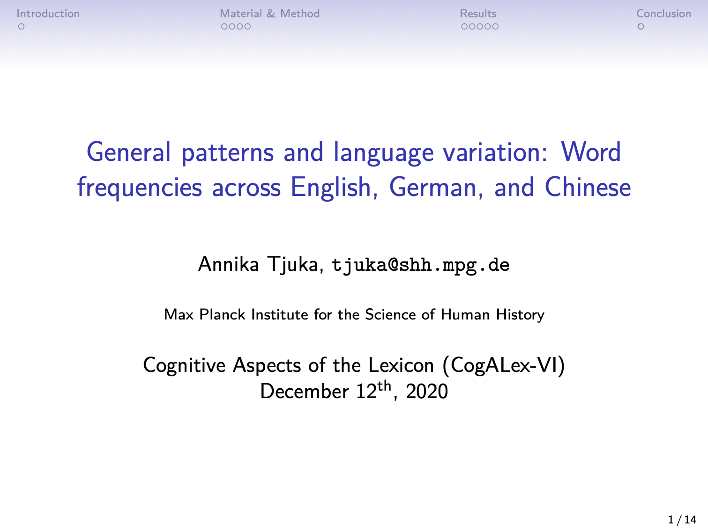

General patterns and language variation: Word frequencies across English, German, and Chinese

_<a href="https://sites.google.com/view/cogalex-2020" target="_blank">6th Cognitive Aspects of the Lexicon Workshop (CogALex)</a>_ at COLING 2020. Barcelona, online.

- <a href="slides/tjuka2020_frequencies_CogALex.pdf" target="_blank">Slides</a>

- <a href="https://youtu.be/AMqc9b4pY4g" target="_blank">Video</a>

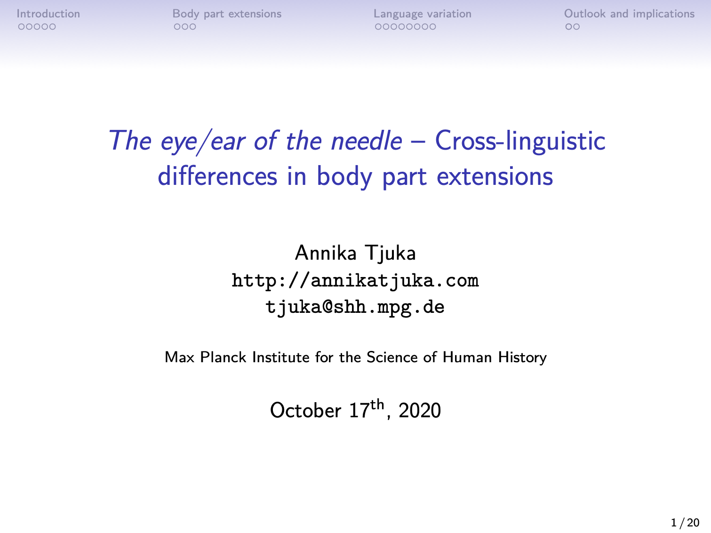

The eye/ear of the needle – Cross-linguistic differences in body part extensions

_1st Words in the World (WoW) International Conference_. Canada, online.

- <a href="slides/tjuka2020_body_object_colexifications_WoW.pdf" target="_blank">Slides</a>

- <a href="https://youtu.be/ldQKwfyImYU" target="_blank">Video</a>

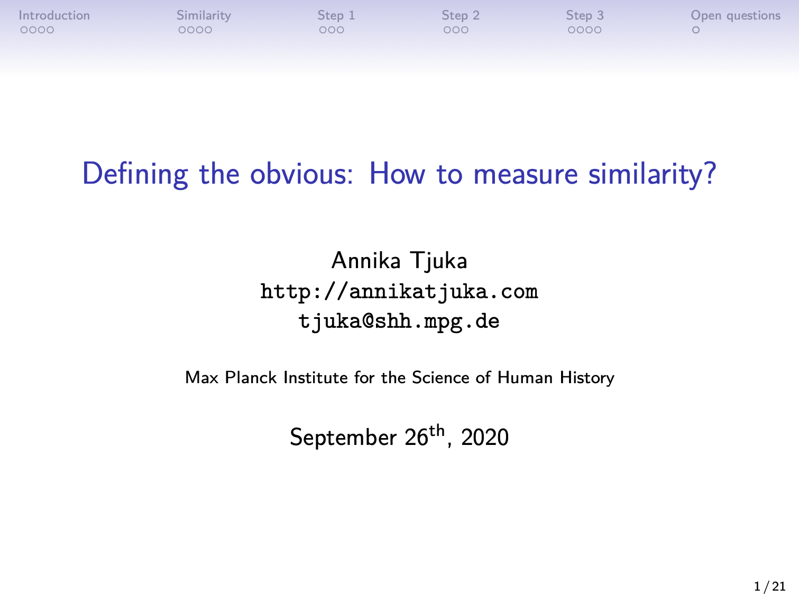

Defining the obvious: How to measure similarity?

_16th Sprachwissenschaftliche Tagung für Promotionsstudierende_. Vienna, online.

- <a href="slides/tjuka2020_similarity_STaPs.pdf" target="_blank">Slides</a>

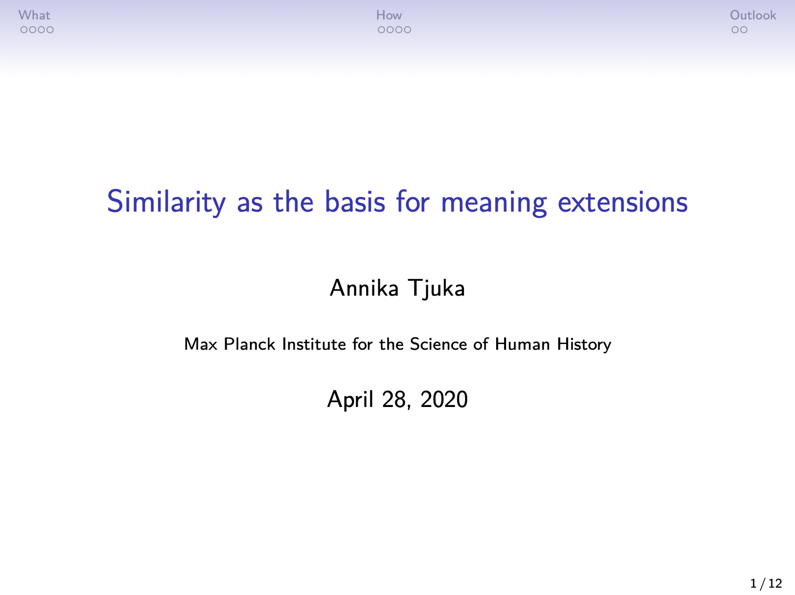

Similarity as the basis for meaning extensions

_Meeting of the Department of Linguistic and Cultural Evolution_. Max Planck Institute for the Science of Human History, Jena, online.

- <a href="slides/tjuka2020_similarity_DLCEmeeting.pdf" target="_blank">Slides</a>

# 2019

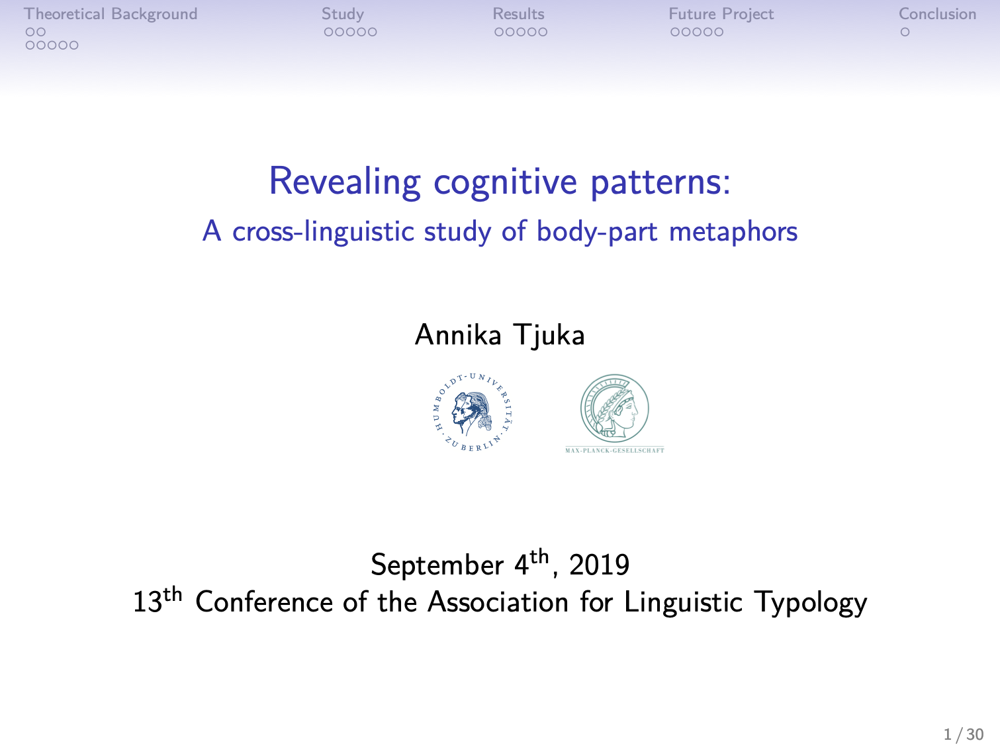

Revealing cognitive patterns: A cross-linguistic study of body-part metaphors

_<a href="https://sites.google.com/universitadipavia.it/alt2019/home" target="_blank">13th International Conference of the Association for Linguistic Typology</a>_. Pavia, IT.

- <a href="slides/tjuka2019_bodypart_metaphors_ALT.pdf" target="_blank">Slides</a>

- <a href="https://drive.google.com/file/d/1Mos92cIc_9rFSXk7jfFuX-lDAgrYcROC/view" target="_blank">Abstract (page 222)</a>

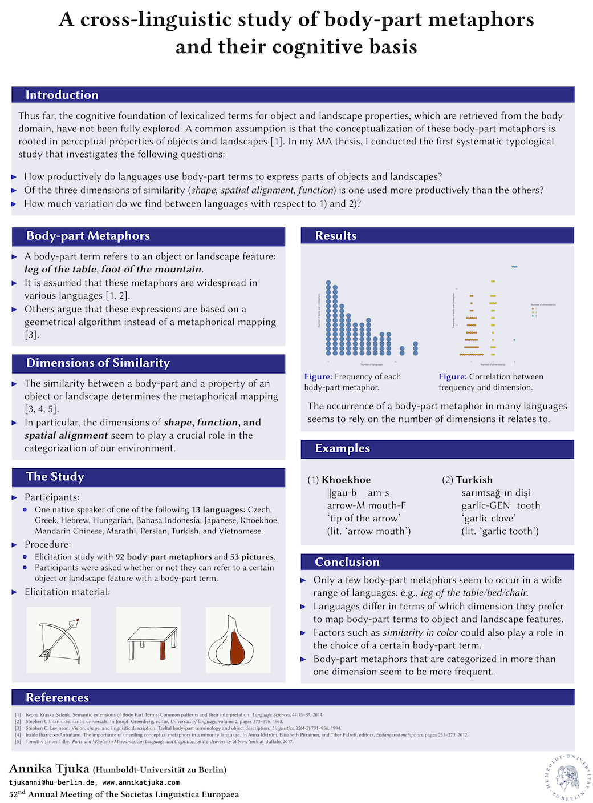

A cross-linguistic study of body-part metaphors and their cognitive basis

_<a href="https://societaslinguistica.eu/meetings/" target="_blank">52th Annual Meeting of the Societas Linguistica Europaea</a>_. Leipzig, DE.

- <a href="slides/tjuka2019_bodymetaphors_SLE_poster.pdf" target="_blank">Poster</a>

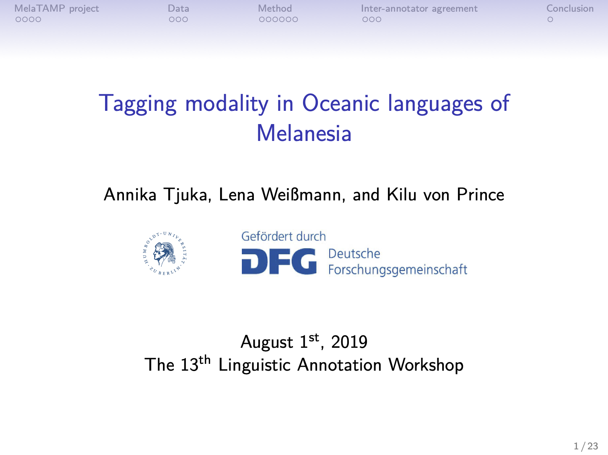

Tagging modality in Oceanic languages of Melanesia

With Lena Weißmann and Kilu von Prince

_<a href="https://sigann.github.io/LAW-XIII-2019/" target="_blank">13th Linguistic Annotation Workshop (LAW XIII)</a>_ at ACL 2019. Florence, IT.

- <a href="slides/tjuka2019_tagging_modality_LAW.pdf" target="_blank">Slides</a>

- <a href="https://sigann.github.io/LAW-XIII-2019/pdf/W19-4008.pdf" target="_blank">Proceedings Article</a>

Shirts, scarves, or socks: Remembering focus alternatives in Vietnamese

With Huong Thi Thu Nguyen and Katharina Spalek

_<a href="https://www.hse.ru/en/neuroling/summer_school_2019/" target="_blank">Neurolinguistics Summer School</a>_. Moscow, RU.

- <a href="slides/tjuka2019_Vietnamese_focus_poster.pdf" target="_blank">Poster</a>

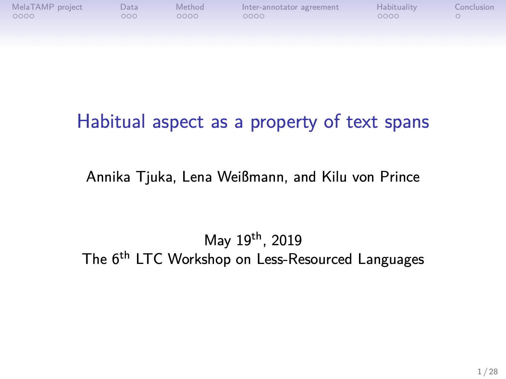

Habitual aspect as a property of text spans

With Lena Weißmann and Kilu von Prince

_<a href="http://ltc.amu.edu.pl/" target="_blank">9th Language & Technology Conference</a>_. Poznań, POL.

- <a href="slides/tjuka2019_habitual_textspans_LTCworkshop.pdf" target="_blank">Slides</a>

- <a href="slides/tjuka2019_habitual_textspans_LTCworkshop_poster.pdf" target="_blank">Poster</a>

- <a href="https://www.researchgate.net/publication/333210593_Habitual_aspect_as_a_property_of_text_spans" target="_blank">Proceedings Article</a> 

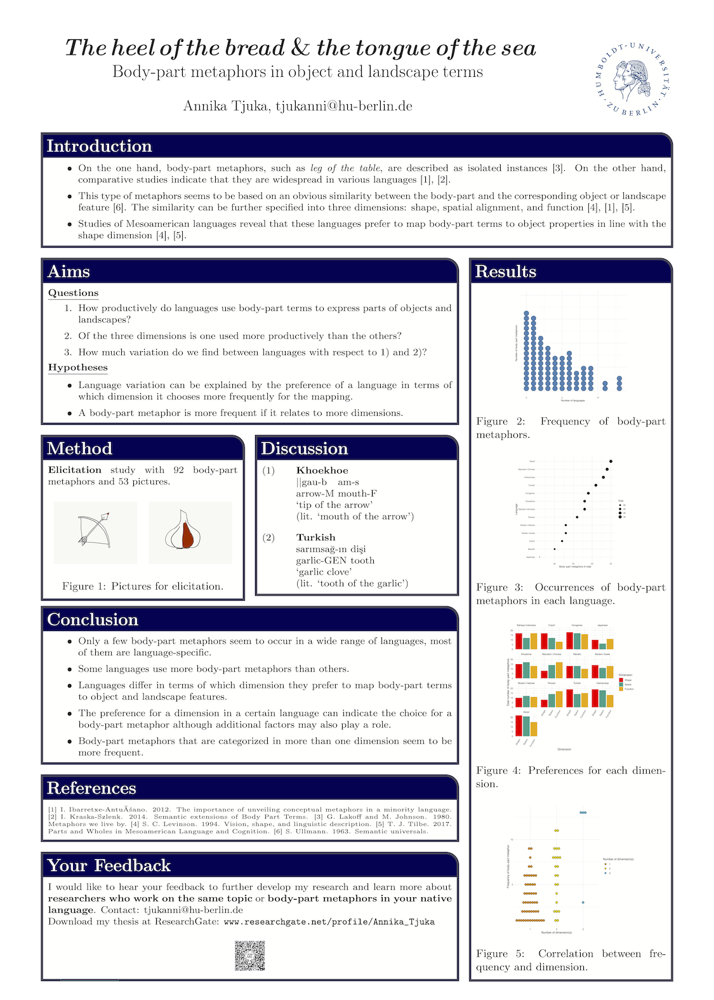

_The heel of the bread & the tongue of the sea_: Body-part metaphors in object and landscape terms

_<a href="https://www.creativeml.ox.ac.uk/creative-power-metaphor-multimedia-output/index.html" target="_blank">The Creative Power of Metaphor Conference</a>_. Oxford, UK.

- <a href="slides/tjuka2019_methaphor_Oxford_poster.pdf" target="_blank">Poster</a>

# 2018

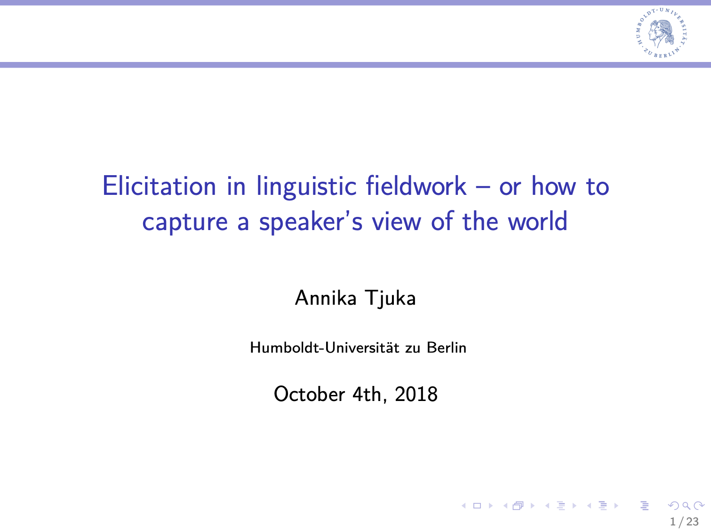

Elicitation in linguistic fieldwork -- or how to capture a speaker's view of the world

_3rd Conference for Student Research_. Bochum, DE.

- <a href="slides/tjuka2018_fieldwork_elicitation_studentconf.pdf" target="_blank">Slides</a>

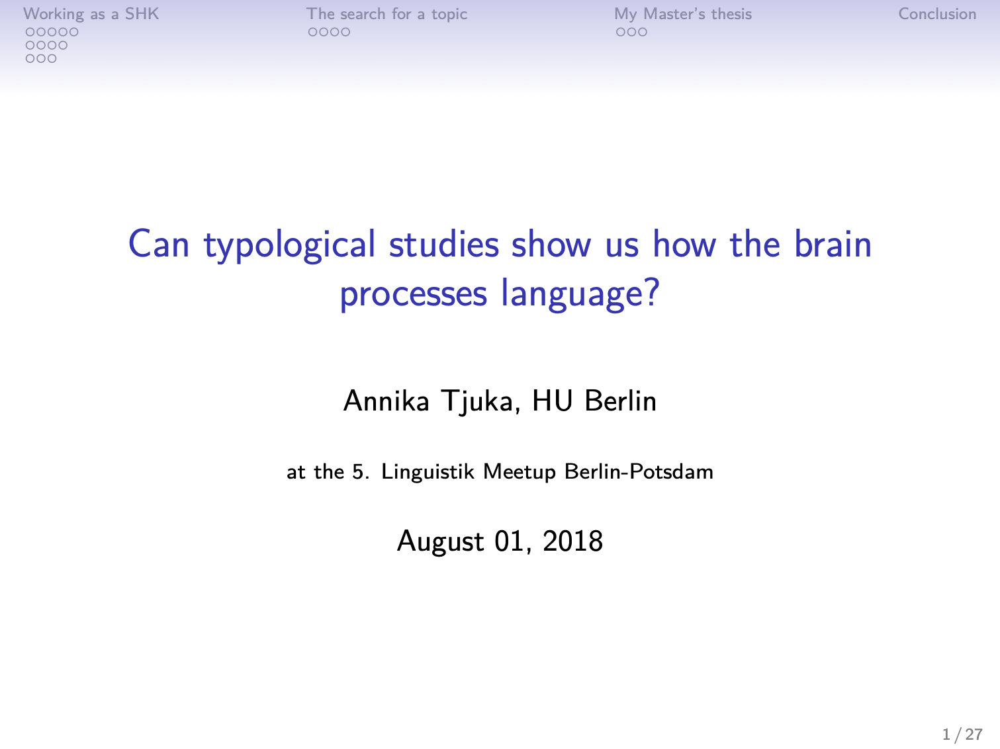

Can typological studies show us how the brain processes language? 

_<a href="https://5.meetup.junge-sprachwissenschaft.de/" target="_blank">5th Linguistik Meet-up Berlin-Potsdam</a>_. Potsdam, DE.

- <a href="slides/tjuka2018_typological_studies_linguisticmeetup.pdf" target="_blank">Slides</a>

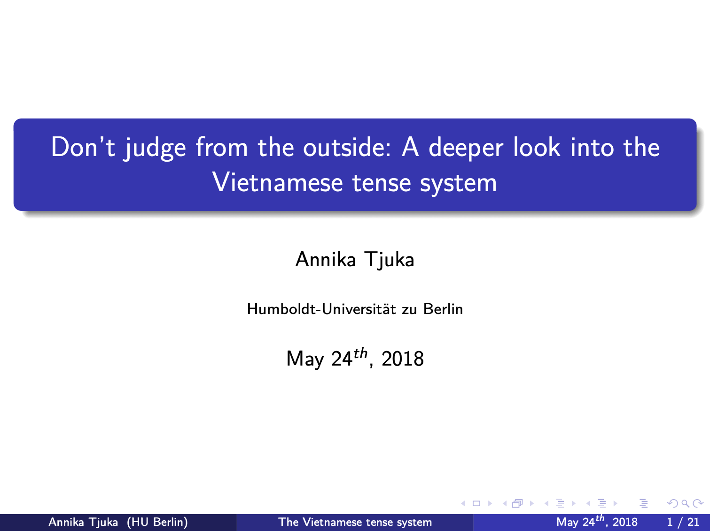

Don't judge from the outside: A deeper look into the Vietnamese tense system

_<a href="https://63.stuts.de/index.html" target="_blank">63rd Linguistics Student Conference (StuTS)</a>_. Kiel, DE.

- <a href="slides/tjuka2018_vietnamese_tenselessnes_StutSconf.pdf" target="_blank">Slides</a>

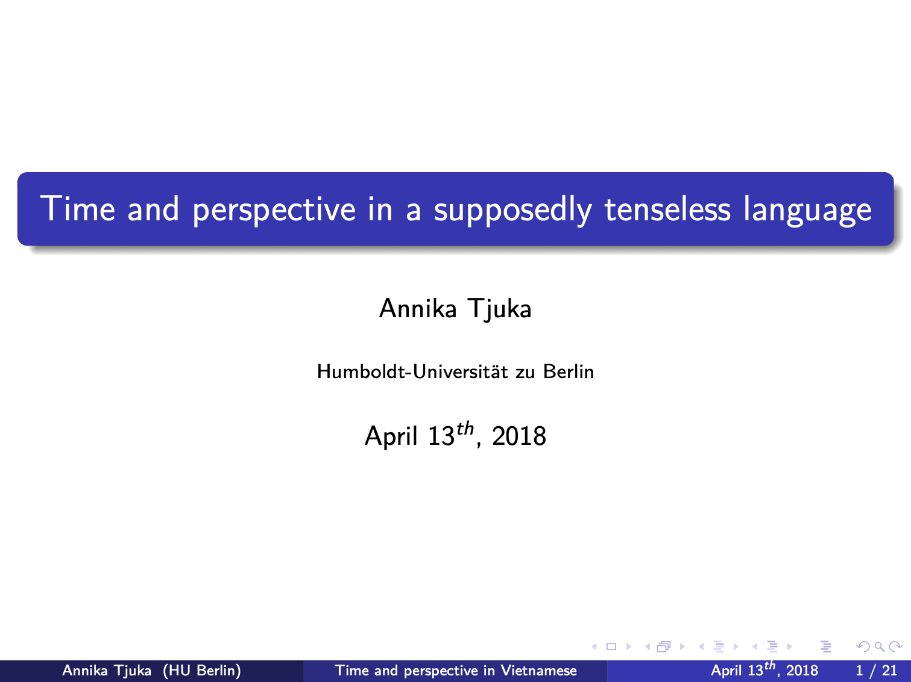

Time and perspective in a supposedly tenseless language

_<a href="https://sites.google.com/site/twistconferenceforlinguistics/" target="_blank">12th T.W.I.S.T. Student Conference for Linguistics</a>_. Leiden, NL.

- <a href="slides/tjuka2018_vietnamese_tenslessnes_twistconf.pdf" target="_blank">Slides</a>

# 2017

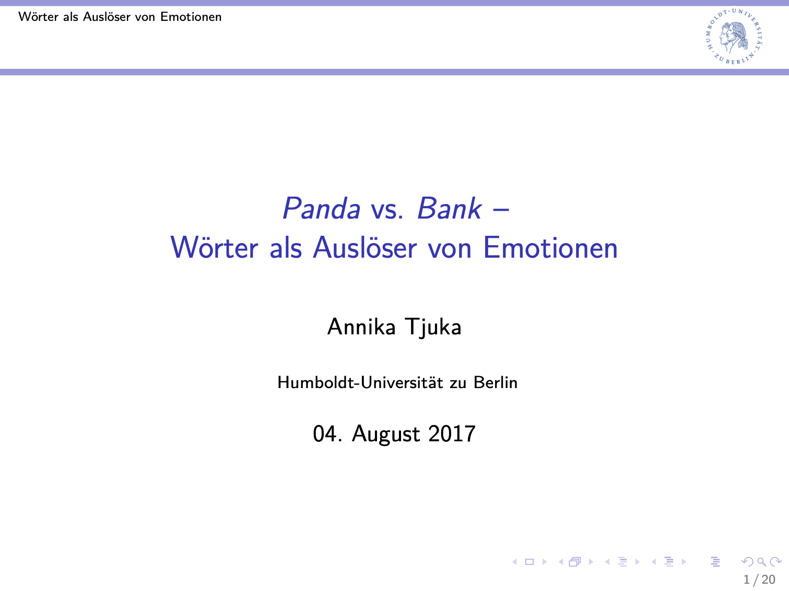

Panda vs. Bank - Wörter als Auslöser von Emotionen 

_2nd Conference for Student Research_. Berlin, DE.

- <a href="slides/tjuka2017_emotions_StudiForsch.pdf" target="_blank">Slides</a>
