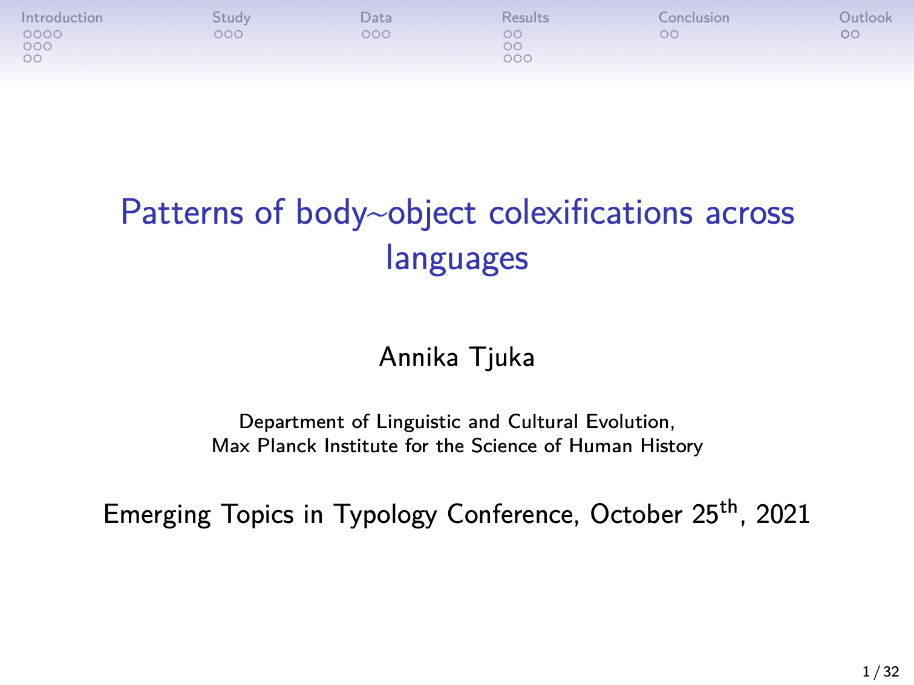

A list of all my talks including recorded lectures.

Back to [annikatjuka.com](https://annikatjuka.github.io/)

# 2021

- <a href="slides/tjuka2021_body-object-colexification_ETT.pdf" target="_blank">Slides</a>

- <a href="slides/tjuka2021-face-Vietnamese-CLIC.pdf" target="_blank">Slides</a>

- <a href="https://youtu.be/AdaagTy00M8" target="_blank">Video</a>

- <a href="slides/tjuka2021-body-colexifications-DUCOG.pdf" target="_blank">Slides</a>

- <a href="slides/tjuka2020_similarity_STaPs.pdf" target="_blank">Slides</a>

- <a href="slides/tjuka2020_similarity_DLCEmeeting.pdf" target="_blank">Slides</a>

